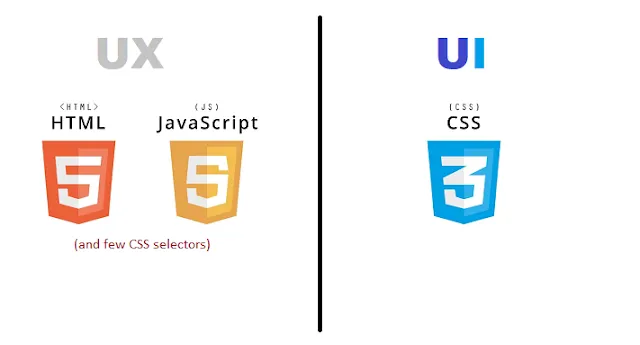
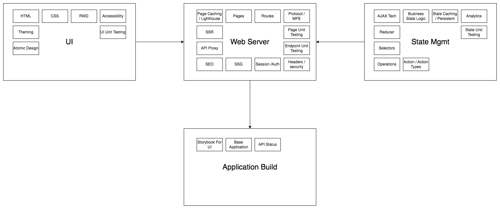
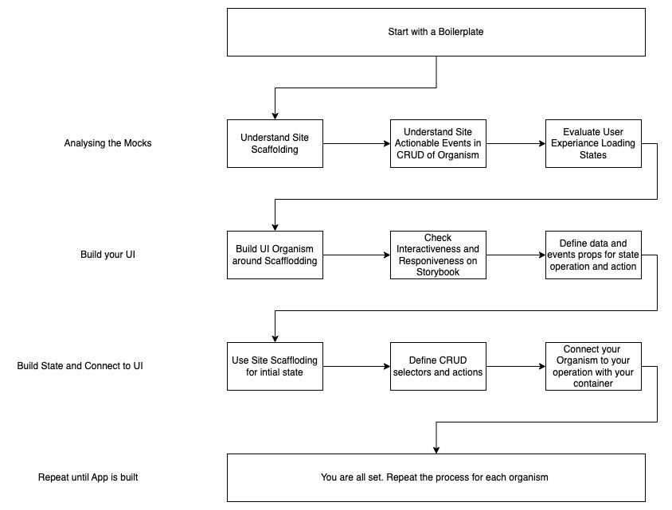

# Elegant

## Installation

```sh
npm install -g elegant
```

# What is Elegant?
Elegant is a command line tool to build frontend architecture in terms of UI and UX persepctive. The command line is framework independent giving you ability to build your flavor of site. Whether, its React, Angular Vue or WC, the tool allows you to generate Components as per atomic design and state Operation as per redux, ngRx or Pinia. The generated files are comprehensive by considering essential props, events, responsiveness, CRUD, unit testing and storybook docs

## Working with UI and UX


## Developer's Perspective of UI and UX



## Enterprise Perspective of UI and UX



## Translating to Atomic Design, Server and State Operations

